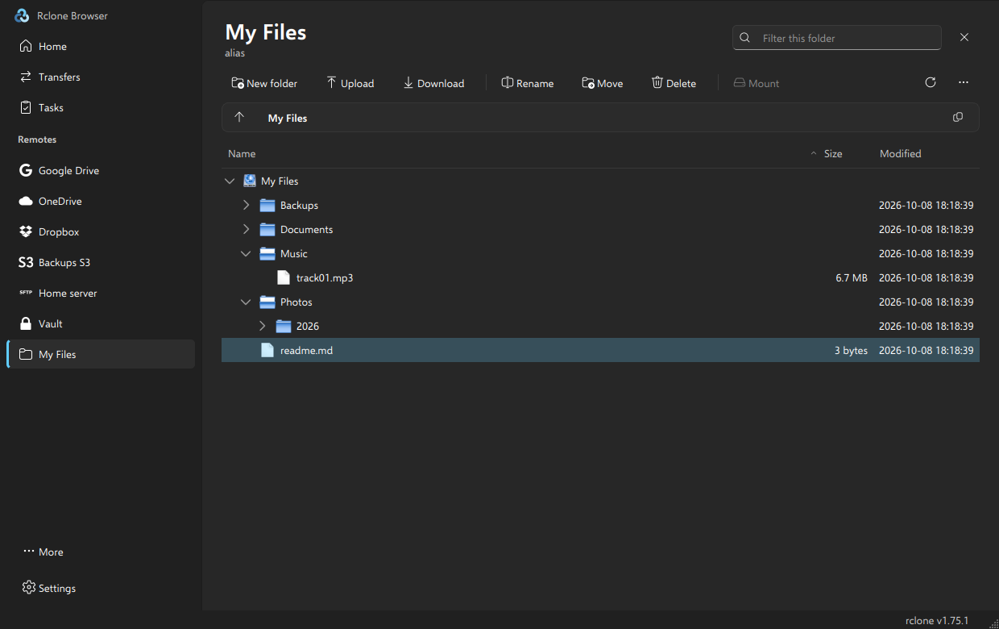

# Rclone Browser for Windows

A modern Windows 11 style app for browsing and transferring files on all your cloud storage, powered by [rclone](https://rclone.org/).

Portable, nothing to install: unzip it anywhere (even on a USB stick) and run.




## Features

- Windows 11 design: navigation pane, command bar, breadcrumb address bar, Fluent icons, light and dark themes, follows your Windows accent colour
- Browse any rclone remote (Google Drive, OneDrive, Dropbox, S3, SFTP, encrypted remotes and 70+ more) using your existing rclone configuration
- Upload, download, create folders, rename, move and delete
- Drag and drop files from File Explorer to upload them
- Filter the current folder by name (Ctrl+F)
- Mount remotes as drive letters (requires [WinFsp](https://winfsp.dev/))
- Stream media files to a player such as [VLC](https://www.videolan.org/)
- Background transfers with live progress, speed and ETA for every file
- Saved tasks: store a transfer once, run it again with one click (or as a dry run)
- Folder size, folder tree, export of file lists, public links
- Built-in rclone updater: rclone is bundled, kept up to date from inside the app, and every download is checksum-verified
- Optional minimise to the system tray with notifications when transfers finish

## Getting started

1. Download `RcloneBrowser-<version>-windows-x64-portable.zip` from the [Releases](../../releases) page, or from the latest successful run on the [Actions](../../actions) page (under **Artifacts**).
2. Extract it to any folder and run `RcloneBrowser.exe`.
3. Windows may show "Windows protected your PC" because the app is not code-signed. Click **More info → Run anyway**.

Your existing remotes appear automatically. If you have none yet, click **New remote** on the Home page to set one up with rclone's setup assistant.

## Portable mode

The download is portable: `RcloneBrowser.ini` next to the exe switches portable mode on, and all settings and saved tasks are stored in that folder.

| What | Where |
|---|---|
| rclone | `rclone\rclone.exe` (updated from inside the app) |
| rclone configuration | `%APPDATA%\rclone\rclone.conf` by default. Copy it to `rclone\rclone.conf` to take your remotes with you. |
| Settings | `RcloneBrowser.ini` |
| Saved tasks | `tasks.bin` |

Paths in portable mode are relative to the app folder, so it keeps working after being moved or copied to another PC.

To use the app in non-portable mode instead, delete `RcloneBrowser.ini`. Settings are then stored in the registry under `HKEY_CURRENT_USER\Software\rclone-browser\rclone-browser` and tasks in `%LOCALAPPDATA%\rclone-browser\rclone-browser`.

## Keyboard shortcuts

| Shortcut | Action |
|---|---|
| Ctrl+F | Filter the current folder |
| F5 | Refresh |
| F7 | New folder |
| F2 | Rename |
| Del | Delete |
| Ctrl+U / Ctrl+D | Upload / Download |
| Alt+Up | Go to parent folder |
| Ctrl+W | Close the open remote |

## rclone updates

The status bar shows the rclone version in use. Once a day the app checks rclone.org (with GitHub as fallback) and offers to install a new version. Updates can also be checked manually via **More → Check for rclone updates…**, and automatic checks can be switched off there.

Each download is verified against rclone's published SHA-256 checksums before it is installed. Updating is safe while transfers or mounts are running; they finish using the previous version.

## Building from source

The app is built automatically by GitHub Actions (`.github/workflows/windows-portable.yml`) on every push. Pushing a tag such as `v1.9.0` also publishes a release.

To build locally:

1. Install [Visual Studio 2022](https://visualstudio.microsoft.com/) with "Desktop development with C++", [CMake](https://cmake.org/) and [Qt 6.8](https://www.qt.io/download-open-source) (MSVC 2022 64-bit, including Qt SVG).
2. From a "x64 Native Tools Command Prompt for VS 2022":

   ```
   cmake -S . -B build -G Ninja -DCMAKE_BUILD_TYPE=Release -DCMAKE_PREFIX_PATH=C:\Qt\6.8.3\msvc2022_64
   cmake --build build
   C:\Qt\6.8.3\msvc2022_64\bin\windeployqt.exe --release build\build\RcloneBrowser.exe
   ```

## Credits

Based on Rclone Browser by [mmozeiko](https://github.com/mmozeiko/RcloneBrowser), [DinCahill](https://github.com/DinCahill/RcloneBrowser) and [kapitainsky](https://github.com/kapitainsky/RcloneBrowser). Icons from [Fluent UI System Icons](https://github.com/microsoft/fluentui-system-icons) by Microsoft (MIT). Licensed under the MIT license.
