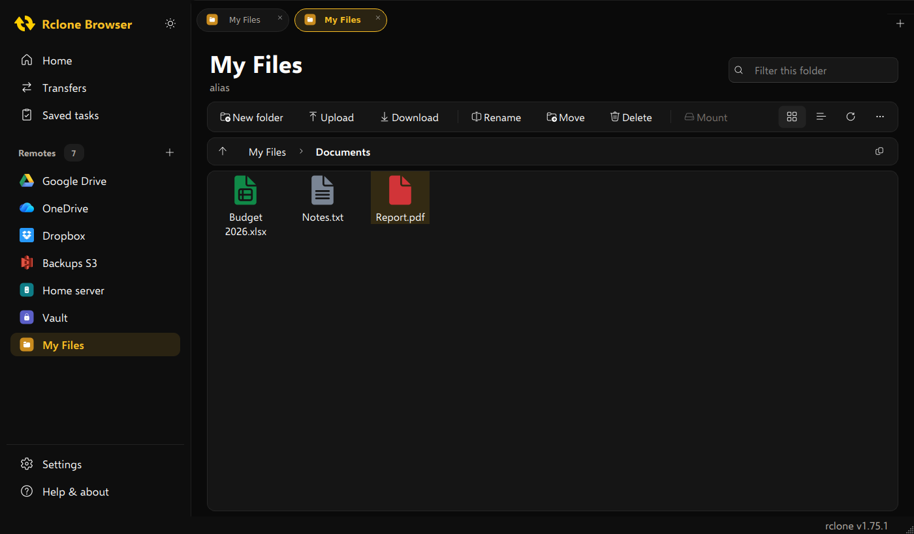
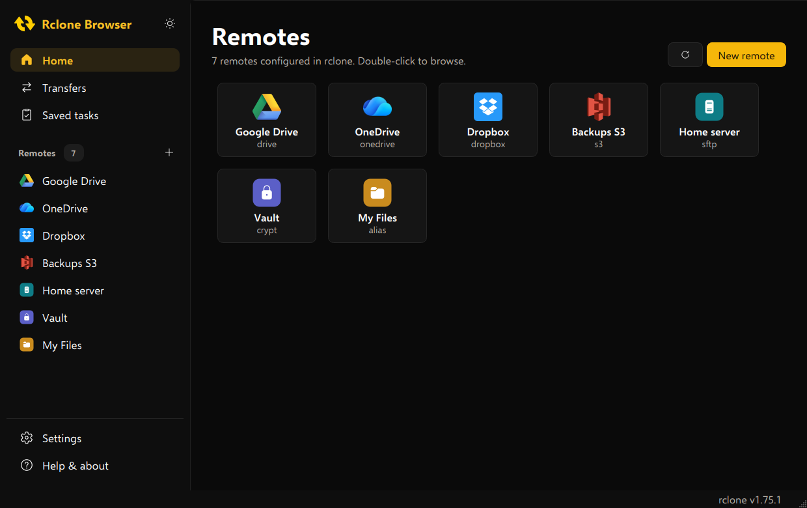
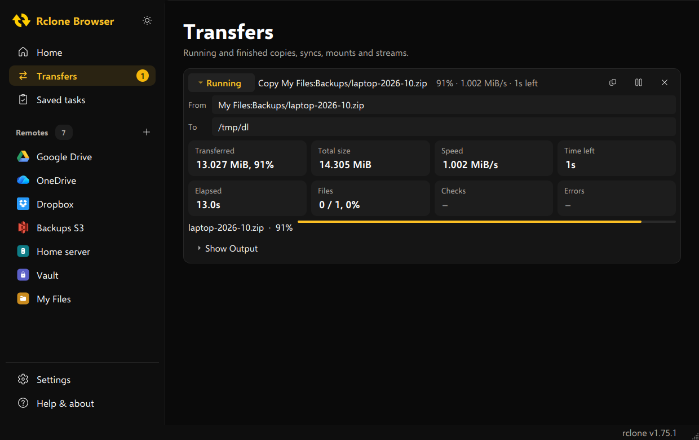
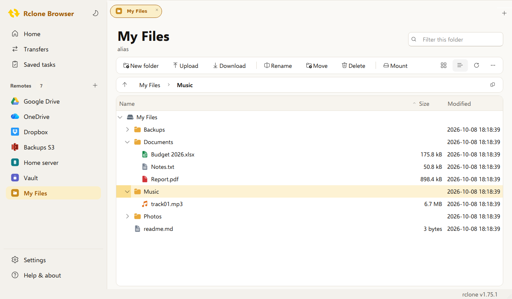

<p align="center"></p>

<h1 align="center">Rclone Browser for Windows</h1>

<p align="center">Browse, transfer and sync files on all your cloud storage, powered by <a href="https://rclone.org/">rclone</a>.<br>Portable, nothing to install: unzip it anywhere (even on a USB stick) and run.</p>

<p align="center"><b><a href="../../releases/latest">Download the latest release</a></b> · <a href="docs/Rclone-Browser-Guide.pdf">User guide (PDF)</a> · <a href="docs/remote-icons.md">Remote icons</a> · <a href="CHANGELOG.md">Changelog</a></p>



## Features

- **Modern design** in black and gold or warm light, with a one-click **light / dark** switch next to the app name
- **All your clouds in one place**: Google Drive, OneDrive, Dropbox, pCloud, S3, SFTP, encrypted remotes and every other rclone storage type, using your existing rclone configuration. Logos for popular services are included; every other service gets a colour-coded tile, or [your own icon](docs/remote-icons.md).
- **Tabs**: open several remotes, or the same remote several times (Ctrl+T)
- **Icons and Details views**: large icons like File Explorer, or a sortable list with sizes and dates
- Upload, download, create folders, rename, move and delete; drag and drop files from File Explorer to upload
- **Transfers you can pause and resume**, with live progress, speed and time left
- Saved **tasks**: store a transfer once, run it again with one click (or as a dry run)
- Breadcrumb address bar, filter the current folder (Ctrl+F)
- Mount remotes as drive letters ([WinFsp](https://winfsp.dev/)) and stream media to a player such as [VLC](https://www.videolan.org/)
- Folder size, folder tree, file list export, public links
- **Built-in rclone updater**: rclone is bundled and kept up to date, every download checksum-verified







## Getting started

1. Download `RcloneBrowser-<version>-windows-x64-portable.zip` from the [latest release](../../releases/latest). The release also lists the file's SHA-256 checksum.
2. Extract it to any folder and run `RcloneBrowser.exe`.
3. Windows may show "Windows protected your PC" because the app is not code-signed: click **More info**, then **Run anyway**.

Your existing remotes appear automatically. If you have none yet, click **New remote** on the Home page (or **+** next to *Remotes* in the sidebar) to set one up with rclone's assistant.

Requires Windows 10 (1809 or newer) or Windows 11, 64-bit. The **[user guide](docs/Rclone-Browser-Guide.pdf)** explains every feature in detail.

## Portable mode

`RcloneBrowser.ini` next to the exe switches portable mode on. Everything stays in the app folder, with paths relative to it, so the folder can be moved or copied to another PC.

| What | Where |
|---|---|
| rclone | `rclone\rclone.exe` (updated from inside the app) |
| rclone configuration | `%APPDATA%\rclone\rclone.conf` by default; copy it to `rclone\rclone.conf` to take your remotes with you |
| Settings | `RcloneBrowser.ini` |
| Saved tasks | `tasks.bin` |
| Remote logos | `icons\remotes\<type>.png`: included logos plus your own (see [remote-icons.md](docs/remote-icons.md)) |

Delete `RcloneBrowser.ini` to use non-portable mode (settings in the registry under `HKEY_CURRENT_USER\Software\rclone-browser`, tasks in `%LOCALAPPDATA%\rclone-browser`).

## Keyboard shortcuts

| Shortcut | Action |
|---|---|
| Ctrl+T / Ctrl+W | New tab / close tab (or middle-click the tab) |
| Ctrl+F | Filter the current folder |
| Ctrl+Shift+1 / Ctrl+Shift+2 | Icons view / Details view |
| Enter, double-click | Open folder |
| Alt+Up | Parent folder |
| F5 · F7 · F2 · Del | Refresh · New folder · Rename · Delete |
| Ctrl+U / Ctrl+D | Upload / Download |

## Security

- Cloud credentials stay in rclone's own configuration; the app never stores them. A config password is kept only in memory and passed to rclone via an environment variable.
- rclone updates are HTTPS-only, verified against rclone's SHA-256 checksums, size-limited and test-run before installation.
- rclone and media players are started without a shell, so file names cannot inject commands.
- Releases are built by GitHub Actions from this repository with every action pinned to an exact commit; each release publishes the zip's SHA-256.

## Building from source

The app is built by GitHub Actions on every push; pushing a tag such as `v3.0.0` publishes a release.

To build locally you need Visual Studio 2022 or newer (C++ desktop development), CMake 3.21+, Ninja and Qt 6.10+ for MSVC 64-bit (including Qt SVG). From a *x64 Native Tools Command Prompt*:

```
cmake -S . -B build -G Ninja -DCMAKE_BUILD_TYPE=Release -DCMAKE_PREFIX_PATH=C:\Qt\6.10.3\msvc2022_64
cmake --build build
ctest --test-dir build
C:\Qt\6.10.3\msvc2022_64\bin\windeployqt.exe --release build\build\RcloneBrowser.exe
```

The user guide is generated with `python docs/guide/build_guide.py` (needs `pip install reportlab`).

## Credits

Based on Rclone Browser by [mmozeiko](https://github.com/mmozeiko/RcloneBrowser), [DinCahill](https://github.com/DinCahill/RcloneBrowser) and [kapitainsky](https://github.com/kapitainsky/RcloneBrowser). Interface icons from [Fluent UI System Icons](https://github.com/microsoft/fluentui-system-icons) by Microsoft (MIT). Licensed under the MIT license.
